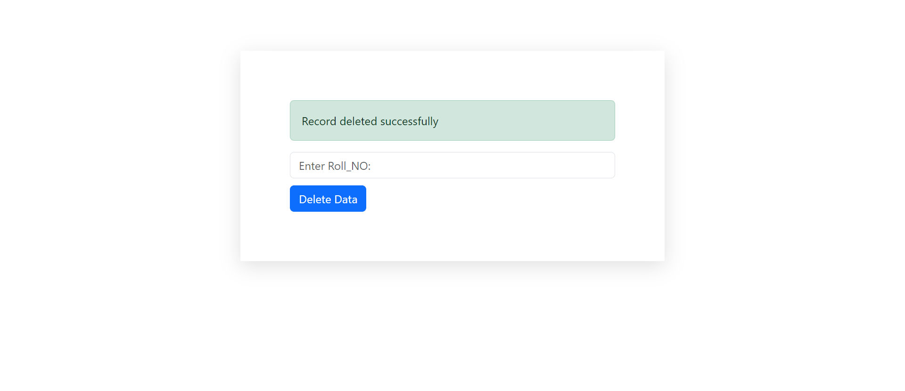

# CRUD Application - Student Data Management

## Overview

This Student Data Management CRUD Application is a PHP-based web application designed to manage student data. It allows users to register new students, delete student records, and update existing records. The system uses MySQL for data storage and Bootstrap for styling.

## Features

- **Register Students**: Add new student records with Roll Number, Full Name, Class, City, and Zip Code.
- **Delete Students**: Remove student records by Roll Number.
- **Update Student Data**: Modify existing student records based on Roll Number.

## Installation

1. **Clone the Repository**

   ```bash
   git clone <repository_url>
   cd <repository_directory>

## Usage

### Register Student


## Delete Student



## Call Student Data


## Update Student Data


### Fields
- Roll (text) - To fetch existing data
- New_Roll (text)
- New_name (text)
- New_Class (text)
- New_City (text)
- New_zip_code (text)


## License
This project is licensed under the MIT License - see the LICENSE file for details.

